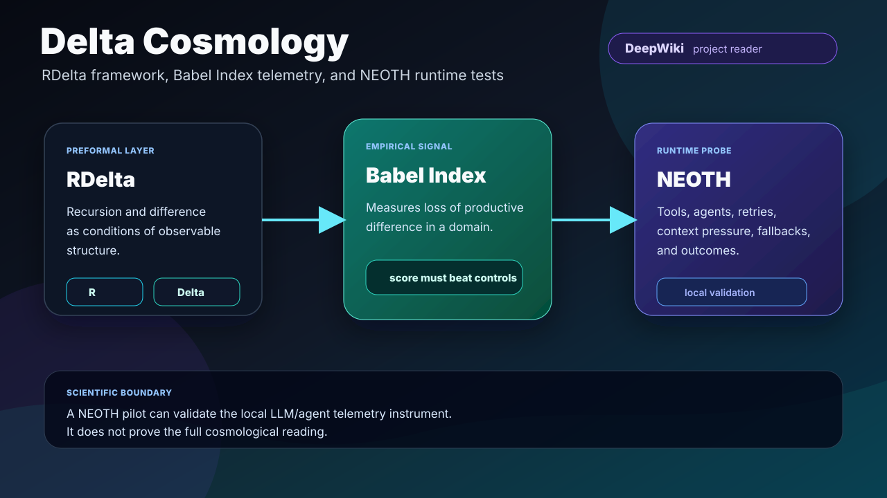

# Delta Cosmology

[](https://github.com/The-Geek-Freaks/delta-kosmologie/actions/workflows/paper-artifact-check.yml)
[](https://github.com/The-Geek-Freaks/delta-kosmologie/actions/workflows/markdown-hygiene.yml)
[](LICENSE)
[](https://github.com/The-Geek-Freaks/NEOTH)
[](https://github.com/The-Geek-Freaks/delta-kosmologie/wiki)
[](https://deepwiki.com/The-Geek-Freaks/delta-kosmologie)

**A preformal framework for recursion, difference, Babel dynamics, and
instrumented LLM/agent-system collapse prediction.**



Delta Cosmology, originally **Delta-Kosmologie**, is a research framework around
the co-dependence of **recursion** and **difference**. Its practical branch is
the **Babel Index**: a domain-specific telemetry model for detecting loss of
productive differentiation in complex systems.

The first live engineering testbed will be
[NEOTH](https://github.com/The-Geek-Freaks/NEOTH), an agentic LLM runtime and
distribution. NEOTH will be used to test whether the Babel Index can predict
tool-chain fragility, context degeneration, agent loops, timeout cascades, and
fallback collapse before they become visible failures.

## Why This Repo Exists

Most AI observability stacks measure local symptoms: latency, token volume,
errors, retries, cost, and benchmark scores. Delta Cosmology asks a sharper
systems question:

> Can we measure when an agentic LLM system loses productive difference because
> coupling, convergence pressure, resource pressure, agent density, and
> information velocity outrun semantic separation and redundancy?

That question becomes testable through the Babel Index family:

```text
B_d(t) = norm_d((C_d * K_d * M_d * A_d * V_d) / (D_d * H_d + epsilon))
```

| Symbol | Meaning | NEOTH runtime proxy |
| --- | --- | --- |
| `C_d` | Coupling degree | Tool/agent dependency graph density |
| `K_d` | Convergence pressure | Output self-similarity, loop proximity |
| `M_d` | Resource pressure | Queue load, context pressure, timeout pressure |
| `A_d` | Agent density | Active autonomous sessions and subagents |
| `V_d` | Information velocity | Requests, tokens, events per rolling window |
| `D_d` | Differentiation capacity | Role, prompt, and tool-schema separability |
| `H_d` | Heterarchy/redundancy | Working fallback routes and modular alternatives |

## The Scientific Boundary

This repository is deliberately strict about claim levels:

- The **cosmological reading** is a speculative preformal framework.
- The **Babel Index** is a domain-specific engineered feature.
- A successful NEOTH pilot would validate only the local LLM/agent telemetry
  instrument, not the full cosmological interpretation.
- The index is useful only if it beats strong null models out of sample.

This is the core anti-hype rule:

> If `B_d` has no incremental signal after controlling for `{C,K,M,A,V,D,H}`,
> the Babel-ratio structure is falsified for that domain.

## Start Here

| What you want | Read this |
| --- | --- |
| Fast conceptual overview | [docs/overview.md](docs/overview.md) |
| Visual overview | [docs/visual-guide.md](docs/visual-guide.md) |
| Curated GitHub Wiki | [GitHub Wiki](https://github.com/The-Geek-Freaks/delta-kosmologie/wiki) |
| DeepWiki project reader | [DeepWiki project reader](https://deepwiki.com/The-Geek-Freaks/delta-kosmologie) |
| Full Markdown reader edition | [paper/delta-cosmology-v1.0.md](paper/delta-cosmology-v1.0.md) |
| HTML reader edition | [paper/delta-cosmology-v1.0.html](paper/delta-cosmology-v1.0.html) |
| NEOTH telemetry integration | [docs/neoth-integration.md](docs/neoth-integration.md) |
| NEOTH discovery/backlink plan | [docs/neoth-discovery-bridge.md](docs/neoth-discovery-bridge.md) |
| Babel Index protocol | [protocols/babel-index.md](protocols/babel-index.md) |
| Pilot B for LLM/agent runtimes | [protocols/pilot-b-neoth.md](protocols/pilot-b-neoth.md) |
| Falsification standard | [docs/falsification.md](docs/falsification.md) |
| Glossary | [docs/glossary.md](docs/glossary.md) |
| Machine-readable project context | [llms.txt](llms.txt) |
| Repository settings and topics | [docs/repository-settings.md](docs/repository-settings.md) |

## Repository Map

| Path | Purpose |
| --- | --- |
| `paper/` | Markdown, HTML, and local paper artifact notes |
| `docs/` | Framework explanation, diagrams, discovery, integration notes |
| `protocols/` | Empirical protocols, null models, and falsification criteria |
| `schemas/` | Machine-readable telemetry/event schemas |
| `examples/` | Example telemetry windows and expected fields |
| `assets/` | SVG diagrams, pipeline maps, and social-preview assets |
| `metadata/` | Suggested GitHub repository metadata and topics |
| `scripts/` | Local repository validation |
| `wiki/` | Versioned source pages for the GitHub Wiki |
| `.github/` | CI, issue templates, contribution hygiene |
| GitHub Wiki | Curated reader pages for framework, protocol, visuals, and glossary |

## NEOTH As The First Runtime Probe

[NEOTH](https://github.com/The-Geek-Freaks/NEOTH) is the first intended
real-world testbed for Delta Cosmology's LLM/agent branch.

The integration plan:

1. Observe NEOTH orchestration events asynchronously.
2. Aggregate rolling windows over inference calls, tool calls, retries,
   fallback attempts, context pressure, agent activity, and outcomes.
3. Compute raw features `{C,K,M,A,V,D,H}`.
4. Compute candidate Babel variants.
5. Test whether `B_NEOTH` predicts failures beyond raw telemetry features.

The goal is not mysticism. The goal is operational early warning for complex
agent systems.

## Local Validation

This repository intentionally stays dependency-light. The quality gate uses
only the Python standard library:

```bash
python scripts/validate_repository.py
```

The check covers required artifacts, local links, JSON metadata, SVG
well-formedness, example telemetry shape, wiki page links, NEOTH backlinks,
DeepWiki backlinks, and GitHub topic consistency.

## Keywords

`llm-agents`, `ai-agents`, `agentic-ai`, `ai-observability`,
`agent-observability`, `llm-evaluation`, `ai-safety`, `complex-systems`,
`systems-theory`, `telemetry`, `collapse-prediction`, `babel-index`,
`rdelta`, `neoth`, `tool-use`, `context-degeneration`, `agent-loops`,
`semantic-collapse`, `llm-observability`, `runtime-telemetry`.

## Citation

Use [CITATION.cff](CITATION.cff) for citation metadata.

## License

Paper, documentation, protocols, schemas, and examples are licensed under
[CC BY 4.0](LICENSE), unless a file states otherwise.
