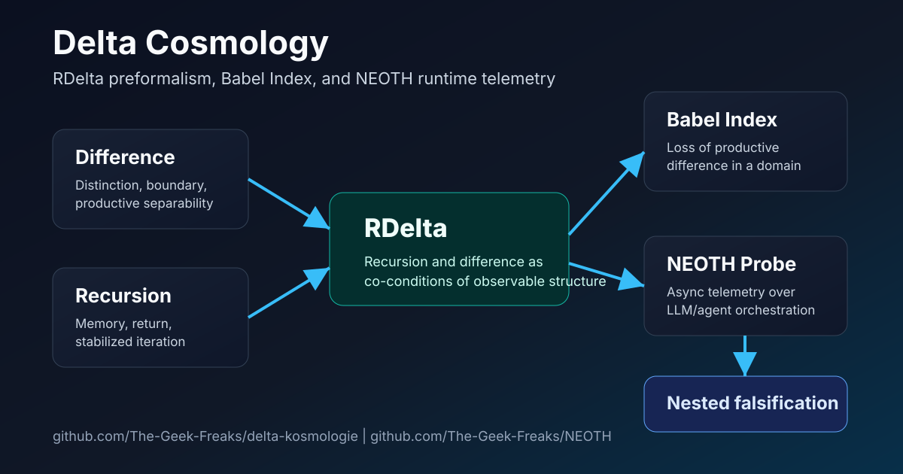
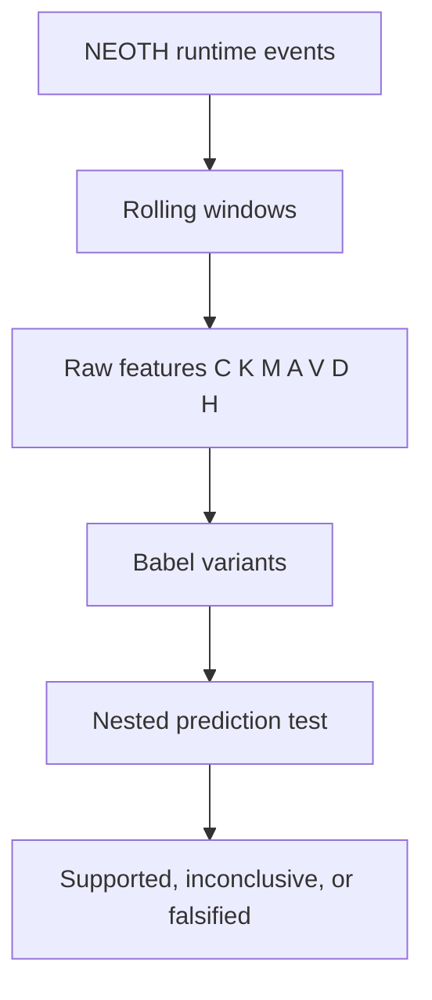

# Framework Map

## Layers

| Layer | Function | Claim type |
| --- | --- | --- |
| Difference | Distinction, boundary, separability | Preformal operator |
| Recursion | Memory, return, stabilization | Preformal operator |
| RDelta | Co-condition of observable structure | Framework primitive |
| Babel Index | Domain-specific degradation feature | Empirical instrument |
| NEOTH Probe | Runtime telemetry implementation | Engineering testbed |
| Nested falsification | Model comparison and null tests | Scientific boundary |

## Event Flow

The important point is that the Babel score is not accepted because it looks
elegant. It must add signal after the raw features and standard controls are
already in the model.
