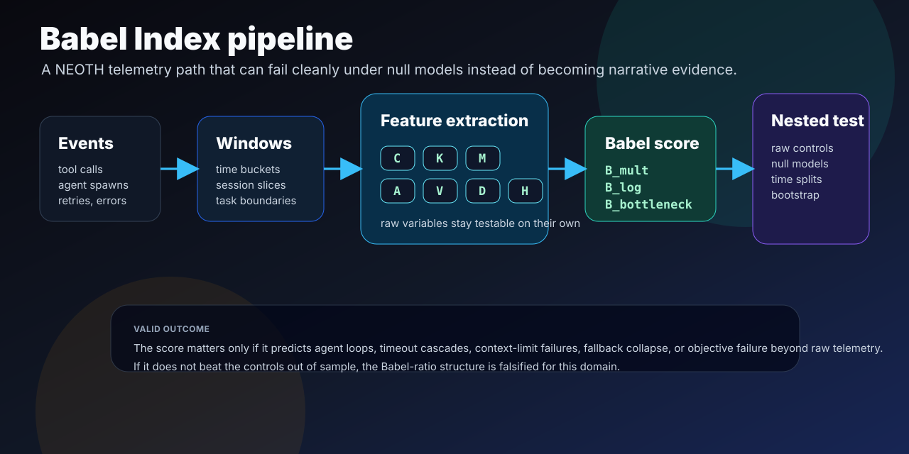
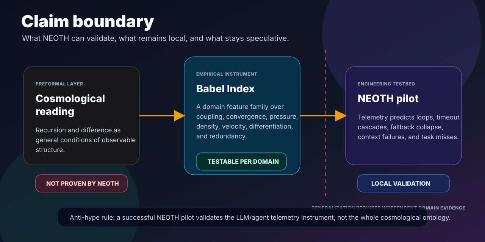

# Visual Guide

This page collects the core diagrams used to explain Delta Cosmology without
turning the framework into a black box.

## README Overview

The README hero is the short public-facing map: framework, empirical score,
engineering probe, and scientific boundary in one screen.

## Framework Map

The framework map shows the route from the two preformal operators into the
engineering surface. Difference and recursion feed `RDelta`; `RDelta` becomes
testable only when translated into a domain instrument such as the Babel Index.
The NEOTH probe sits on the empirical side of the claim boundary.

## Babel Index Pipeline

The pipeline diagram is the implementation view. NEOTH runtime events become
rolling windows, raw variables, candidate Babel scores, and nested tests. The
score is useful only if it predicts failure modes beyond raw telemetry.

## Claim Boundary

The claim-boundary diagram is the anti-hype guard. A successful NEOTH pilot can
validate the local LLM/agent telemetry instrument. It does not prove the full
cosmological reading without independent domain evidence.

## DeepWiki

The generated DeepWiki project reader is available at:

https://deepwiki.com/The-Geek-Freaks/delta-kosmologie
